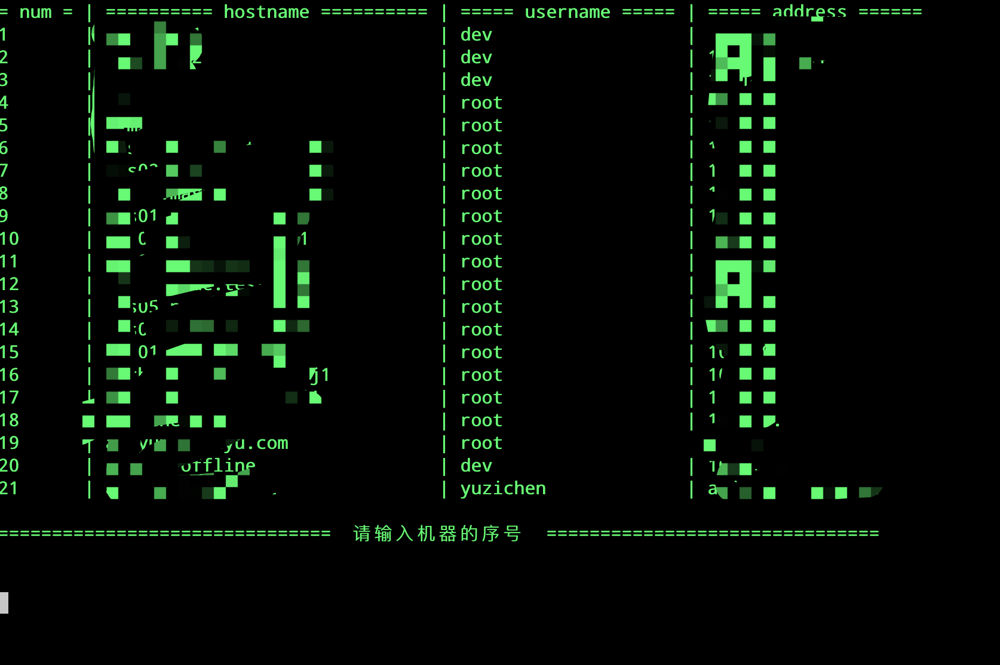

# 基于 go 的本地跳板机 💻

`mac`上使用最多的终端软件是`item2`，但是`item2`连接服务器（记住密码方式）很是不方便，要配置`profile`，如果连接多个机器，就需要配置多个`profile`，如果想加入个性化设置：背景虚化、字体等，则需要每个`profile`都进行修改，很是不方便。

此工程通过建立跳板机原理，选择机器进行登录。

## 支持:
 - [x] 用户名密码登录
 - [x] 密钥登录
 - [x] 密钥密码登录
 - [x] 序号选择
 - [x] 检索

## 安装:
### 源码安装
 1. `go get github.com/chazyu1996/leap`

 2. `cd $GOPATH/src/github.com/chazyu1996/leap`

 3. `go build leap.go`

 4. 编辑 `config.yaml` 文件

### 二进制安装

在此下载二进制文件即可`https://github.com/chazyu1996/leap/releases`

## 使用：
1. 执行 leap 可执行文件
2. 选择序号，或输入`ip`或`主机名`检索
3. 检索后输入序号即可连接

## 截图：

